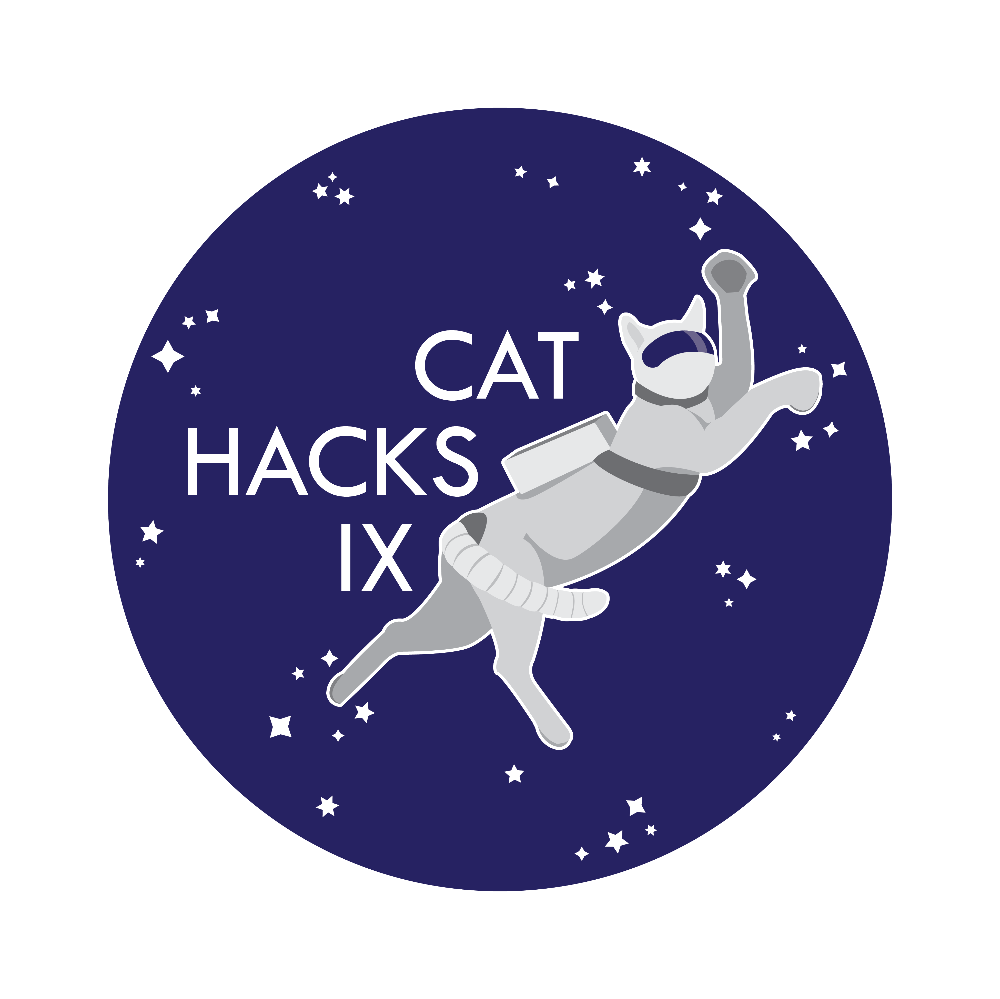
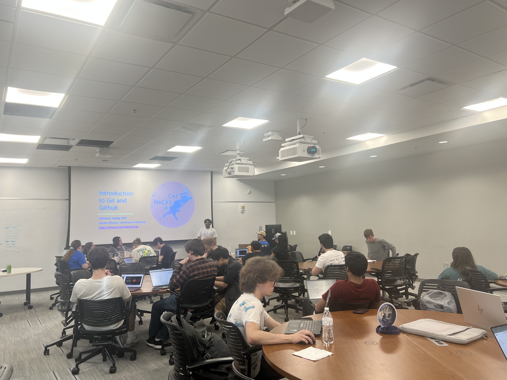
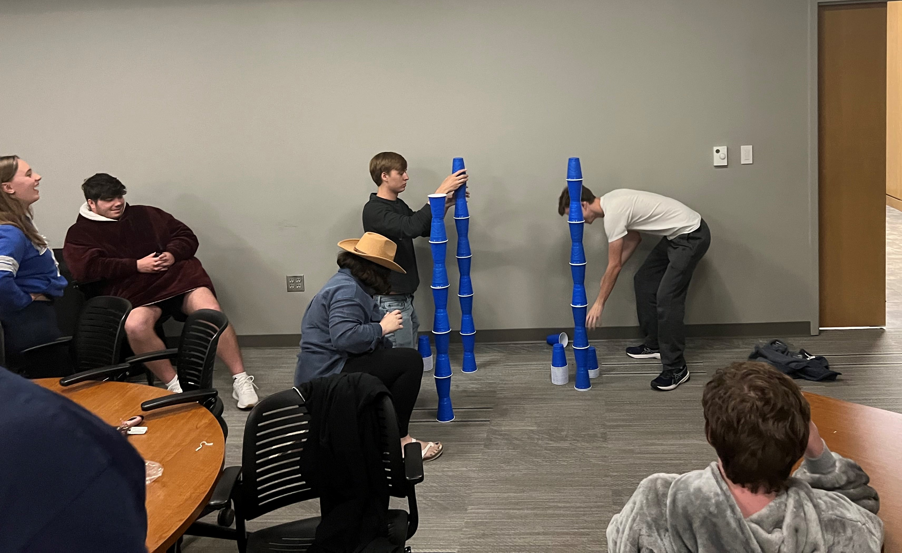
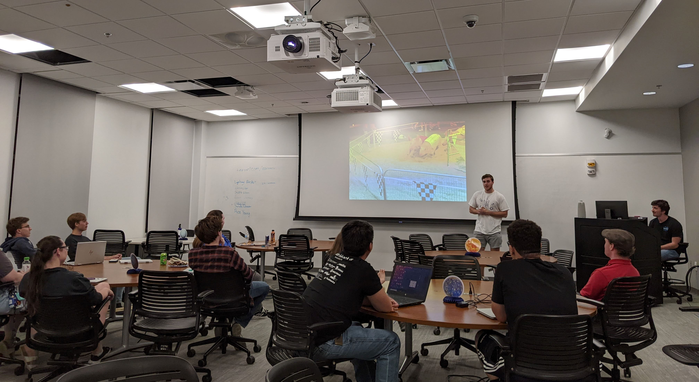
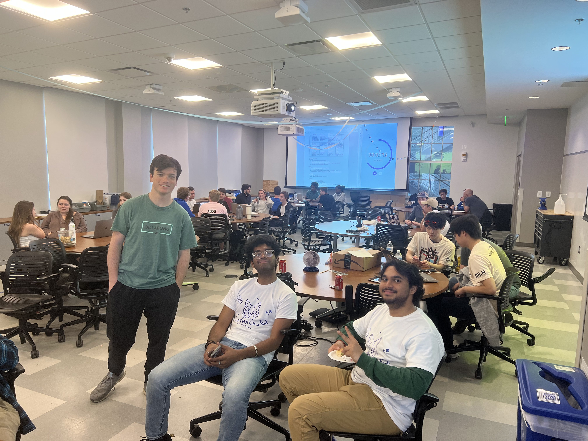
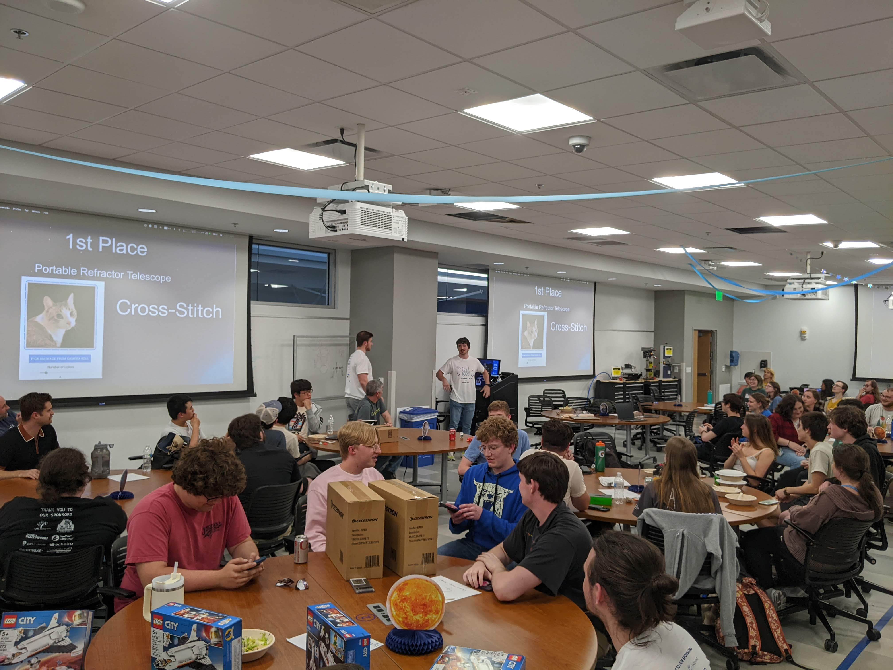
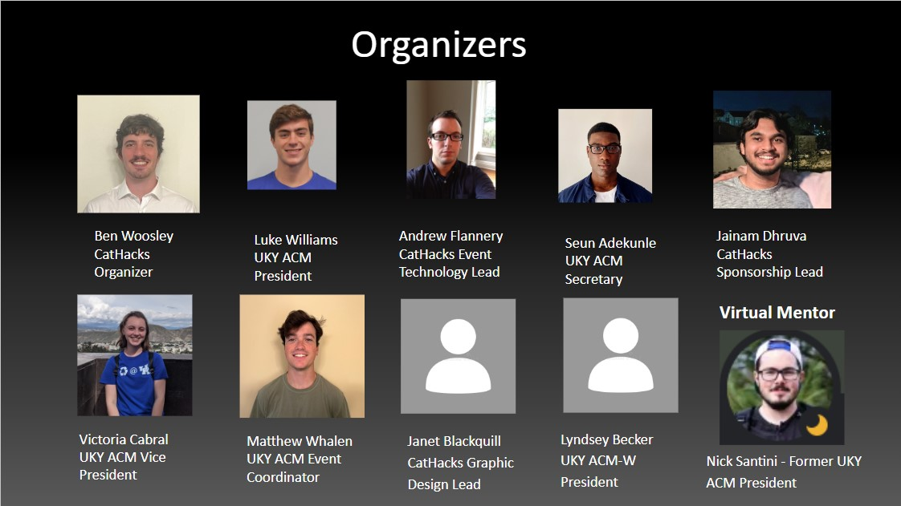

# CatHacks IX, 2023
 - **April 14-15, 2023** 
 - **University of Kentucky, Association for Computing Machinery**
 - **Lexington, KY, USA** 
 
 

## Event Summary

- CatHacks is the biggest Hackathon in the state of Kentucky! The hacker community in Kentucky is growing every year, and we aim to make this community more inclusive and accessible.   
- We had several workshops and mini-events planned throughout the hackthon.  
    1. Introduction to Git and Github Workshop.
    2. Painting with Bob Ross
    3. Presentation Karaoke
    4. MLH Cup Stacking mini-event
    5. ACM-W + NSBE Diversity Workshop
    6. Earth Hacks Workshop
    7. Jackbox Games mini-event
- We had an "Introduction to Git and **GitHub**" workshop at the beginning of the event to encourage students to use Git and Github in their projects. We also referred hackers to the student developer pack by **GitHub** when they were trying to find technologies offered by the student developer pack.   

## Event Metrics 

| Attendees |First Time Hackers| Projects|
|---------------:|--------------:|------------:|
|57|14|18 [(Devpost)](https://cathacks-ix.devpost.com/project-gallery)| 

## Tech Impact / Diversity 

### Tell us about your hacker demographics
 - Our target audience was the hacker community either in Kentucky or close to Kentucky. Because there are no other major hackathons in the region, we aim to provide a place that is close in proximity for people from all backgrounds to hack, learn, and have fun!  

### Event Diversity Breakdown
| Male | Female | Non-binary/Non-conforming | Transgender | 
|---------------:|--------------:|------------:|---------:|
|43|10|3|1| 

### Where were your hackers from?
| Asia Pacific | North America | Europe / UK | Other |
|---------------:|--------------:|------------:|---------:|
|0|57|0|0|

## Impact of GitHub Grant
- How did you use the grant funds?  
-- The funds were used to cover all the prizes we have decided on for our participants. They also helped us cover the costs of setting up the physical space and the associated janitorial services.
- How did the funds positively affect the outcomes of your event participants?  
-- The funds played a crucial role in bringing the event together. Due to adequeate prizes, we had many hackers who came up with awesome ideas and used the prizes as a motivation.  
-- Github funds allowed us the money we raised from other sponsors to be used towards getting plenty food, drinks, and snacks so that the hackers didn't have to worry about that and could focus hacking and having fun!

## Top Projects
Even with a limited sample size, the spectrum of projects was amazing! We had people use Machine Learning, Web Development, Game Development, Hardware hacks, and many more things withing these 24 hours! Here are some of the projects our judges loved (and we loved as well) and announced them as winners:

- [**Cross-Stitch Maker**](https://devpost.com/software/cross-stitch-maker): A mobile app for Android that accepts images from the phone gallery, and allows you to produce a low-fidelity cross-stitch pattern using machine learning. The user is allowed to customize the size of their pattern, and the number of different colors of floss. All colors in the pattern map directly to real colors you can purchase at craft stores like Michaels!

- [**WarPaint Robots**](https://devpost.com/software/totally-not-fireboy-and-watergirl): Local multiplayer game where two players run around platforms racing to get coins with a portal twist.   

- [**Melody Map**](https://devpost.com/software/melody-map-24wtxn): Oftentimes at music festivals there can be an overwhelming amount of artists, times, and locations. Our goal is to simplify this experience by taking user data to recommend a music festival map. !

- [**Youniverse**](https://devpost.com/software/youniverse-frst6m): This website provides a daily 'challenge' to encourage users to complete at least one mental health activity each day.

To keep the projects limited, we will not mention all the projects. But we strongly believe that this all the project submissions this year were creative, innovative, and amazing to learn about.

All the listed projects above used Github to host and share their projects! All the listed projects above were built by teams, and we were happy to see teams collaborate  on projects using Github.  

## Event Photos

|  |
|:--:|
| <b><u>Intro to Git and Github Workshop </b> </u>|  

|  |
|:--:|
| <b><u> MLH Cup Stacking Mini-Event </b> </u>|   

|  |
|:--:|
| <b><u> Presentation Karaoke Mini-Event </b> </u>|   

|  |
|:--:|
| <b> <u>Judging in Session </b> </u>|   

|  |
|:--:|
| <b> <u> Closing Ceremony </b> </u>|   

|  <u>First Place Winners </b> </u>|   

|  |
|:--:|
| <b> <u>CatHacks Organizers </b> </u>|   

## What’s Next?
- CatHacks IX was a great success for the hackers and the organizers. We saw more hackers attend CatHacks this year compared to previous year and saw more project submissions. The projects were diverse and amazing. CatHacks team feels that it was successfully able to provide its hackers with resources they needed for the hackathon! 
- CatHacks X will tentatively be happening in April 2024, celebrating a decade of CatHacks!  
- Twitter: https://twitter.com/UKCatHacks
