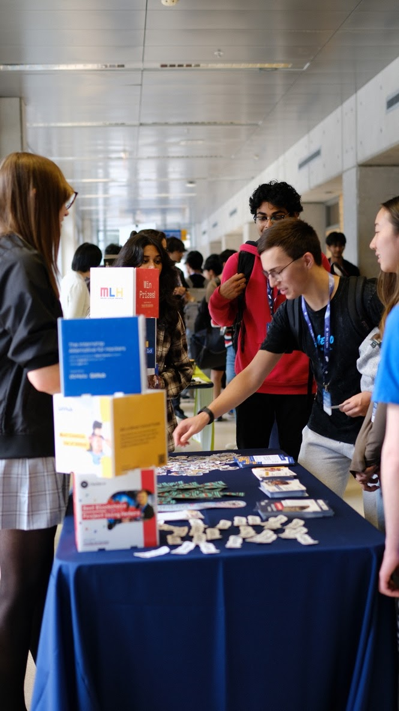
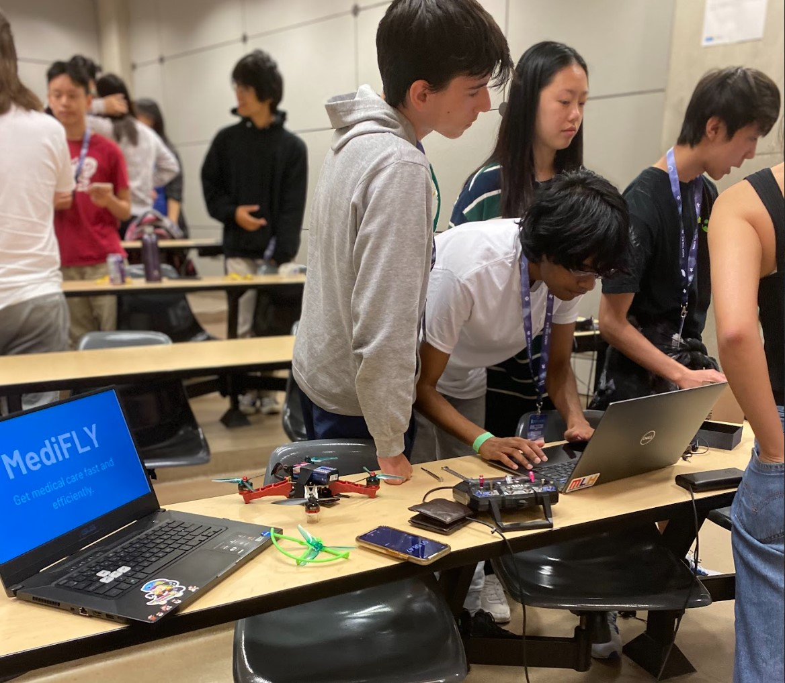

# Hack the 6ix
 - **Date: August 18-20**   
 - **Organization: Hack the 6ix**   
 - **Location: Canada, Ontario, Toronto**  

## Event Summary

- What made your hackathon special or unique?   
- Tell us about some of the cool features, mini-events, or workshops that your organizers put on.  
- How was **GitHub** featured at your event?   
- *We’d love to see pictures if you have them!*  

Following the pandemic, this was our first in-person pandemic in a while and transitioning away from virtual settings was a challenge. Because Hack the 6ix is not affiliated with one university as a club, we were able to involve multiple universities and have their presence to help students be exposed to what's around them. This time, we were able to involve TMU as the venue sponsor, TMU Blockchain as a workshop speaker, and UofT Rotman as a bronze tier sponsor. Waterloo Blockchain was also scheduled to host a workshop, but unforeseen circumstances made it unable to happen this year unfortunately. Some cool events that we had included "How I sold a startup at 20 years old" workshop, in real life among us event, chubby bunny challenge, and even a Valorant game tournament for hackers interested in gaming. Github was featured as a prize stream and mentioned in both opening and closing ceremony. We encouraged hackers to find creative ways to use github when hacking their project.

Some of our pictures of our event can be found [here!](https://drive.google.com/drive/folders/1N8lnchX1p6VOhOhh3LWIWHdvHVpZnugR)

## Event Metrics 
> Feel free to include any other metrics that you think may be important or applicable. 

| Attendees |First Time Hackers| Projects|
|---------------:|--------------:|------------:|
|204|90|[51](https://hackthe6ix2023.devpost.com/)| 

## Tech Impact / Diversity 

### Tell us about your hacker demographics
 - Who was the target audience for your event?   
 - What does the diversity breakdown look like? (Include the percentage of hackers who identify as female, non-binary or other)  

The most common education category was year 2 university students (113 attendees) followed by high schoolers (98 attendees). As a non-university-affiliated hackathon, Hack the 6ix can target high schoolers with the goal of exposing them to like-minded, driven people in the GTA region and connect with different university sponsors. The diversity breakdown is as follows:

### What Gender do you hackers identify with?
| Male | Female | Non-binary | Prefer not to say |
|---------------:|--------------:|------------:|---------:|
|71%|25%|2%|2%|

### What race & ethnicities did your hackers identify as?
| Native American /   Alaskan Native | Black /   African American | Hispanic /   Latinx | Asian | White | Prefer not to answer |
|---------------:|--------------:|------------:|---------:|--------:|
|1|3|0|279|16|7|17|

### Where were your hackers from?
| Asia Pacific | North America | Europe / UK | Other |
|---------------:|--------------:|------------:|---------:|
|{# of hackers}|{# of hackers}|{# of hackers}|{# of hackers}|

## Impact of GitHub Grant
- How did you use the grant funds?  
- How did the funds positively affect the outcomes of your event participants?  
- (Be as detailed as possible! Being able to track the impact of these funds will go a long way in ensuring the program's longevity.) 

The GitHub Grant had a positive effect on our entire event. As it was our first time hosting a fully in person event since the pandemice, our expenses were higher compared to previous years, and we also had a weaker revenue stream as well. The GitHub grant served as a relief, and we used to support a variety of expenses such as hacker meals, swag coverage, and purchasing hardware for hackers. As a result, it had a positive impact on our event by allowing us to provide more and elevate the experience, creating a really great "back in person" event! Some of these expenses, such as hardware and swag will also continue to have a long term impact on Hack the 6ix as they can be reused for future events. 

## Top Projects

- What were some of the coolest projects at your event?   
- We also want to see how hackers used GitHub at the event  
- What made them special? _Include the link to their website, Devpost or video._

Through out the span of 36 hours, our hackers put together lots of unique and creative hacks! Here are the top 3 submissions:

- First Place - [Professor Puddles](https://devpost.com/software/professor-puddles) : a duck-shaped desk buddy that warns, yells, and sprays water at users if their posture is poor   
- Second Place -  [MediFly](https://devpost.com/software/medifly) : A drone that delivers medication and uses facial recognition to ensure the medication is delivered to the right user   
- Third Place - [ReadRight](https://devpost.com/software/readright-q5exuz) : A launguage learning app tailored towards people with dyslexia & dysgraphia   

## Event Photos

- We want to see how great your event was!  
- Please include pictures and/or video of your event highlights! Use the format below: 

|  |
|:--:|
| <b> Hckers and Sponsors <3 </b>|

|  |
|:--:|
| <b> Opening Ceremony! </b>|

|  |
|:--:|
| <b> Keynotes and Workshops! </b>|

|  |
|:--:|
| <b> Judging all the amazing submissions! </b>|

## What’s Next?
- Include a high-level wrap-up summary  
- What are the dates for your future hackathon?  
- Twitter & Instagram handles (if applicable)  

Currently we are aiming to expanding the amount of hackers we can accept for our in person event next year! We plan on doing this by expanding our revenue portfolio by focusing on grants and continuing to expand our prize streams so we can collaborate with more companies. Additionally, as Hack the 6ix is open to high school students as well, we want a higher degree of university involvment by hosting workshops (e.g. Q&A with current upper years) or continuing to working with universities for venues and sponsorships. The date for next years iteration is still TBD, but will likely take place in August.

Stay tuned! :)
- [@hackthe6ix](https://www.instagram.com/hackthe6ix/)
- [Website](https://hackthe6ix.com/)

