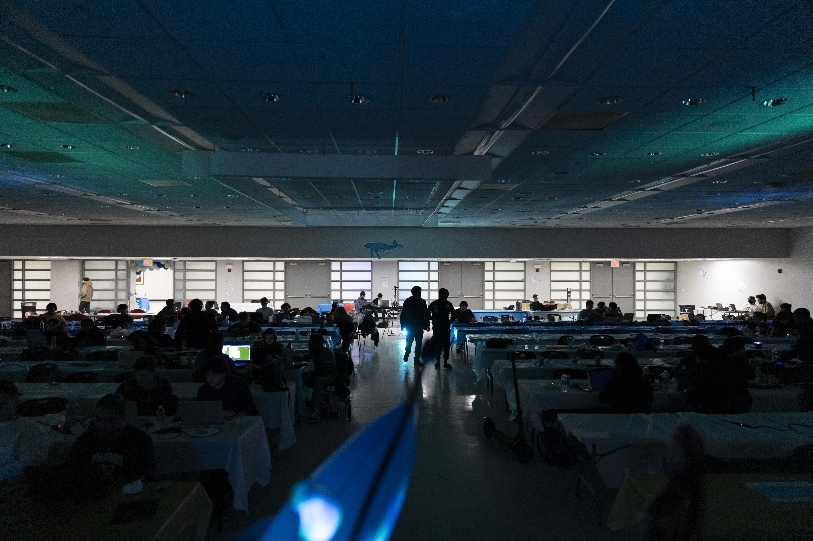

# HackNJIT 2023

 - **Start/end date**: November 4-5, 2023
 - **University/Organization Name**: New Jersey Institute of Technology, Association for Computing Machinery (NJIT ACM)
 - **Location**: Newark, NJ

## Event Summary

HackNJIT is NJIT ACM's annual 24-hour software hackathon that is beginner-friendly. The goal is to allow students to complete a project that will be beneficial to their career, learn new skills via the hosted workshops or other hackers, or take a break from the multiple mini-events. 
Throughout the event, plenty of resources were provided to hackers to fully showcase their skills and creativity with this year's theme of nautical! To keep hackers engaged and welcomed, several raffles were held throughout the event and the venue was decorated around the theme!

### Workshops

- GitHub: showcasing the basics of using GitHub.
- AWS: talked about AWS usage and impact on modern services.
- MLH/ACM: Beginners' Guide, Team Building, and Project Submission Guide.
- Verizon: project discussion.
- DataBank
- Patient Safety Technologies: project discussion.
- Google Developers Student Club: how to develop apps on Android.

### Side-Events
- Computer/Console Recreation Room
- MLH Cup Stacking
- Keyboard Typing Competition
- Pokemon Showdown Competition
- Midnight Karaoke

### How was GitHub featured at your event?
HackNJIT 2023 had fully utilized GitHub as a part of the submission guidelines. Hackers were required to finalize all their commits with their submissions on Devpost. The goal is to make sure the projects' completions were in the allotted time and that the code generated during the event was original and made within the given time.

## Event Metrics 

| Attendees | Projects|
|---------------:|------------:|
| 370 | 63 (https://hacknjit-2023.devpost.com/project-gallery) |

### Post-Event Survey (75 Submissions)
| First Time Hackers |
|---------------:|
| 50 |

## Tech Impact / Diversity 

### Hacker demographics
HackNJIT's target demographic is college students who are 18 and older. The goal was to welcome any college or university student to NJIT to join HackNJIT. This also includes first-time hackers as the event was planned to be beginner friendly.  

### Where were your hackers from?

| Asia Pacific | North America | Europe / UK | Other |
|---------------:|--------------:|------------:|---------:|
| 31 | 320 | 3 | 14 |

## Impact of GitHub Grant
- Thanks to the GitHub Grant, the hackathon was able to handle a larger group of people by providing larger servings of food. Due to the influx of numbers this year, exceeding original expectations, the increased food options and the amount had played a major role in making sure the hackers were fed. The grant funds were also used to give more ambiance to the room through decoration. HackNJIT used the budget to purchase small wave light projectors, inflatable beach-themed decorations, and prints of drawings of sea creatures and ships. According to hackers, the added decorations were one of the favorite parts of the hackathon!

## Top Projects

- 1st Place - [WagerWhales](https://devpost.com/software/wager-whales)
  - A website where people can bet if a fish from a live-streamed aquarium will enter a player's drawn box within a certain time.
- 2nd Place - [Treasure Snap!](https://devpost.com/software/treasure-snap)
  - A geocaching game where users can look at a photo and riddle and try to snap the same photo in the same location.
- 3rd Place - [SeaSOS](https://devpost.com/software/seasos)
  - An AR application that is designed to help demonstrate and streamline maritime emergency protocols for cruises and ships.

## Event Photos

|    |
|:--:|
| **HackNJIT crowd!** |

|  |
|:--:|
| **Midnight spotlights!** |

## What’s Next?
- HackNJIT 2023 was a resounding success! Our attendance touched the peak of HackNJIT's highest record with 370 hackers. Thank you to the NJIT Ying Wu College of Computing for their support in the months leading to the event, and thank you to our sponsors for making everything happen! We hope that the hackers were able to learn something new or create a great project to showcase! For the future, HackNJIT will try to build on the success of this year to bring a larger attendance and a more streamlined experience for hackers next year. 
- The next HackNJIT date is still being determined but will happen sometime in Fall 2024.
- [HackNJIT Instagram](https://instagram.com/hacknjit)
- [NJIT ACM Instagram](https://instagram.com/njitacm)
- [NJIT YWCC Instagram](https://www.instagram.com/njityingwu)