# HackByte 2.0 
HackByte 2.0 was a 36-hour, in-person hackathon organized by the amazing peeps at [The Programming Club](https://github.com/BitByte-TPC/) of IIITDM Jabalpur. The Programming Club {TPC} is a student-run developer community at IIITDM Jabalpur, one of the premier colleges in India. HackByte 2.0 built upon our experience in organizing and participating in various hackathons and technical fests around the country. 
Jabalpur is the cultural capital of the state of Madhya Pradesh but lacks a bit on the technical community side, and to improve upon this we at TPC have been [conducting meetups, sessions, and workshops around the year](https://gdsc.community.dev/indian-institute-of-information-technology-design-and-manufacturing-jabalpur-india/). HackByte has been our flagship event, building upon our experience organizing internal hackathons and events for the 700 member strong developer community on our campus. 

HackByte 2.0 drew 2200+ registrations pan-India, which was a significant increase from 1400 registrations last year. HackByte aims to unite tech enthusiasts, enabling them to explore the latest industry trends, share knowledge, and collaborate on innovative projects. It served as a platform for students to showcase skills, collaborate, network, and learn from seasoned mentors.

The opening and closing ceremony was held in the Auditorium which can seat up to 600 people and the hacking spaces were Lecture Halls L104, and L105 which can seat up to 260people each. This enabled us to have sessions in parallel and have more interaction with the hackers. 
 - **5 - 7 April, 2024** 
 - **IIITDM Jabalpur**
 - **Jabalpur, Madhya Pradesh, India**
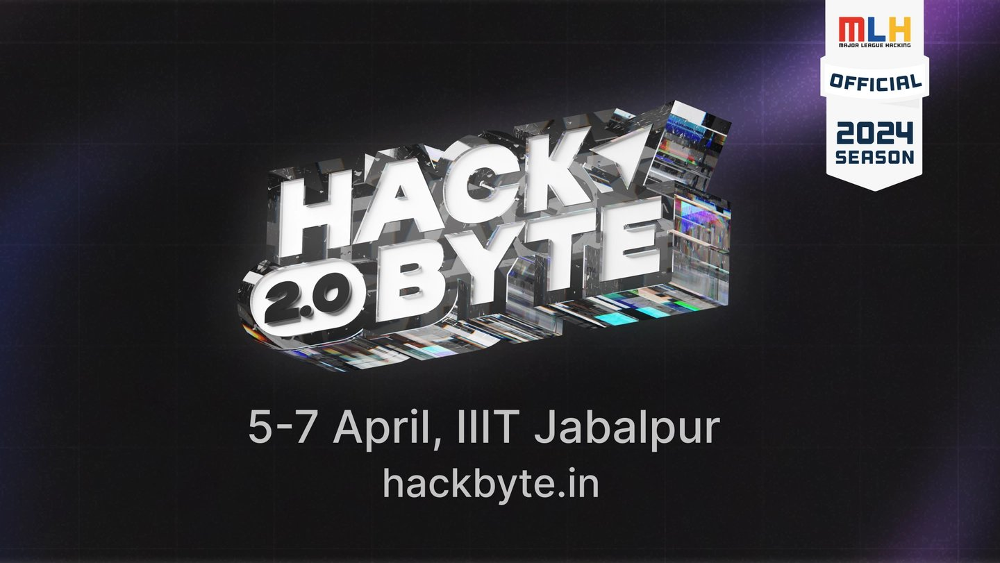

## Event Summary

### 5th April: Setting the Stage for Innovation
Before the opening ceremony, participants received identity cards, goodies, refreshments, and meal coupons. Our amazing partners including Logitech, Postman, GitHub, MLH, and Virtual Protocol got to interact with the hackers through booths. Meal coupons could be redeemed at the mess {for all hackers, volunteers, and organizers} with refreshments available throughout the event.
The opening ceremony started at 5:30 PM, 5th April unveiling the theme and kicking off the event, with participants being informed about guidelines, prizes, and the hackathon's flow. Mentors and guests shared valuable insights, sharing their anticipation and eagerness to see wonderful projects take shape during HackByte.

### 6th April: Deep Dives and Technical Expertise
The first checkpoint was at 1:30 AM, to help hackers understand the submission platform Devfolio. Parallel to this, the first mentorship round kicked off, providing participants with a chance to showcase their progress and receive valuable feedback from mentors. This early feedback loop proved crucial, allowing teams to refine their approaches and address potential roadblocks. 

At 3 AM, as late-night refreshments were being distributed, a fun event **Blind Type** was organized. Participants were invited in a team of 2 to the front of the hacking halls, one teammate was blindfolded and had to type out words that the other teammate was dictating. Monkeytype was chosen as a platform to standardize tests for all.
This was one of the most loved events, with over 120 hackers trying their hands on this unique event. The highest WPM was by team "Incognito" of 56 WPM and they were awarded with the amazing [K950 Wireless Keyboard](https://www.logitech.com/en-in/products/keyboards/signature-slim-k950-keyboard.html).

After a hearty breakfast, the day kicked off with technical deep dives. Sagar (our MLH Coach, who was previously a GitHub Campus Expert as well) conducted a session on GitHub Copilot post which he also has a wonderful drawing contest for the hackers. Have a look at some of the [Labtocat](https://octodex.github.com/labtocat/) submissions 

[Probably the best one](https://twitter.com/prathameshr955/status/1776496345525968970) 
[Has perfected the coat](https://twitter.com/Dipansh00664388/status/1776498531446206604) 
[Funniest iteration](https://twitter.com/spark_vampire/status/1776554373784748154) 
[The one we like](https://twitter.com/BhavyaMadan20/status/1776498894370951502)
[Draws like me](https://twitter.com/grindeat1/status/1776494893046898710) 

In the afternoon, hackers had their 1st judging round helping teams refine their technical approaches and ensure project feasibility. At the same time, participants were encouraged to submit their project ideas and tech stack on the submission platform, as checkpoint 2. 

This was exhausting for mentors and hackers alike, hence we postponed the GitHub Codespaces session by Sanskriti post-dinner, during which hackers got to express their creativity with the GitHub Drawing book. Around 70 teams submitted their drawings, the best ones will be featured on our Twitter page [@hackbyte.tpc](https://www.instagram.com/hackbyte.tpc/).

To get the hackers a much-needed break from debugging, board games including chess, carrom, chinese checker, ludo, and uno were arranged in the auditorium, along with a Table Tennis setup which even our faculty tried their hands on.

### Day 3: The Final Push and Glorious Conclusion
With the deadline fast approaching, Sunday was a day of focus and refinement. Teams worked tirelessly to finalize their projects, ensuring technical soundness and clear documentation. Checkpoint 3 at 10:00 PM saw teams selecting the sponsor tracks they wished to compete in; aligning their projects.
A soft deadline at 5:30 AM was for hackers to submit their projects on Devfolio to avoid any last-minute issues. The final 90mins were for hackers to improve upon documentation and create project demos. 
The hacking phase concluded at 7 AM, post which hackers had a hearty breakfast, taking a sigh of relief. 

## Event Metrics 

| Checkin |First Time Hackers| Projects|
|---------------:|--------------:|------------:|
| 372 | 174 | 96 [Projects on Devfolio](https://hackbyte2.devfolio.co/projects)| 

## Tech Impact / Diversity 

The target audience for HackByte 2.0 included tech enthusiasts, innovators, and individuals interested in learning, collaborating, and pushing the boundaries of their capabilities. We aimed to attract hackers from diverse background and got to meet amazing hackers from Nagpur, Gwalior, Vijaywada, Mumbai, Kolkata and Surat ! 104 Teams RSVP'd for HackByte 2.0 from various states, with different backgrounds and perspectives, contributing to the vibrant and inclusive atmosphere. 55% of our hackers were from outside Jabalpur, showcasing HackByte as an inclusive and welcoming hackathon to a broad audience within the tech community.

## Impact of GitHub Grant
- How did you use the grant funds?  
The GitHub Grant proved to be critical to account for meals and refreshments we planned for 400 hackers. As arranging for meals requires payment upfront, the grant ensured that hackers could get nutritious meals throughout the hackathon.

Arranging for coffee and late-night refreshments was only possible due to the grant amount.

- How did the funds positively affect the outcomes of your event participants?  

Last year, HackByte 1.0 had registration fees which covered for the meals. Improving upon last year, we made HackByte 2.0 an MLH member event and made it a free hackathon, without any monetary interaction with the hackers. Having coffee machines and water dispensers right between the two hacking halls made hackers feel energized throughout the event.
Even for meals, we had multiple meetings with the vendor to ensure nutritional meals which was different from what they usually offer. This increased the per-meal cost by a small amount, but this wasn't an issue as the meal-quality had greatly improved; resulting in a much higher review score. Last year, we scored poorly on the feedback form for food scoring 3.2/5; this year we got an amazing 4.1/5 💖
## Top Projects

Winning Projects of HackByte 2.0 are: 

- 1st Overall Winner is [Phoenix_Force](https://devfolio.co/projects/shuttlesensei-cd84) 
- 2nd Overall Winner is [DankBytes](https://devfolio.co/projects/vulture-9607) 
- 3rd Overall Winner is [Apex.js](https://devfolio.co/projects/ezzerreur-66bc) 
- Best Girls Team was  [Juus](https://devfolio.co/projects/parichay-5fd7) 
- Best Beginner was [Ambuja Cement](https://devfolio.co/projects/isitlegalto-13a4) 

Category Track Winners are :  

- **Best Domain Name** from GoDaddy Registry goes to team [TESSERACT](https://devfolio.co/projects/bharatbhraman-33d3)  

- **Best Use of Taipy** goes to project [AnonymousAID](https://devfolio.co/projects/anonymousaid-2306)  

- **Best Use of MongoDB Atlas** goes to [SoulSpeak](https://devfolio.co/projects/soulspeak-d5f5) project 

- **Best API design** and use of Postman to generate docs had two winners, Team [NextGen Coders](https://devfolio.co/projects/farmcare-e2dc) and Team [Octagram](https://devfolio.co/projects/skinsprite-142f)  

## Event Photos

| 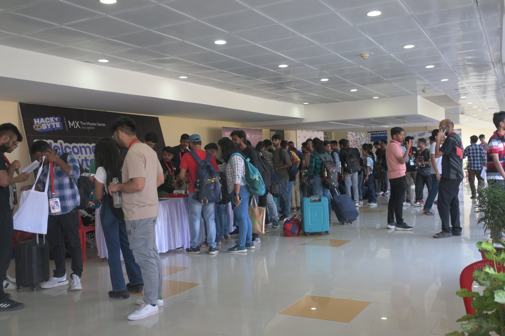 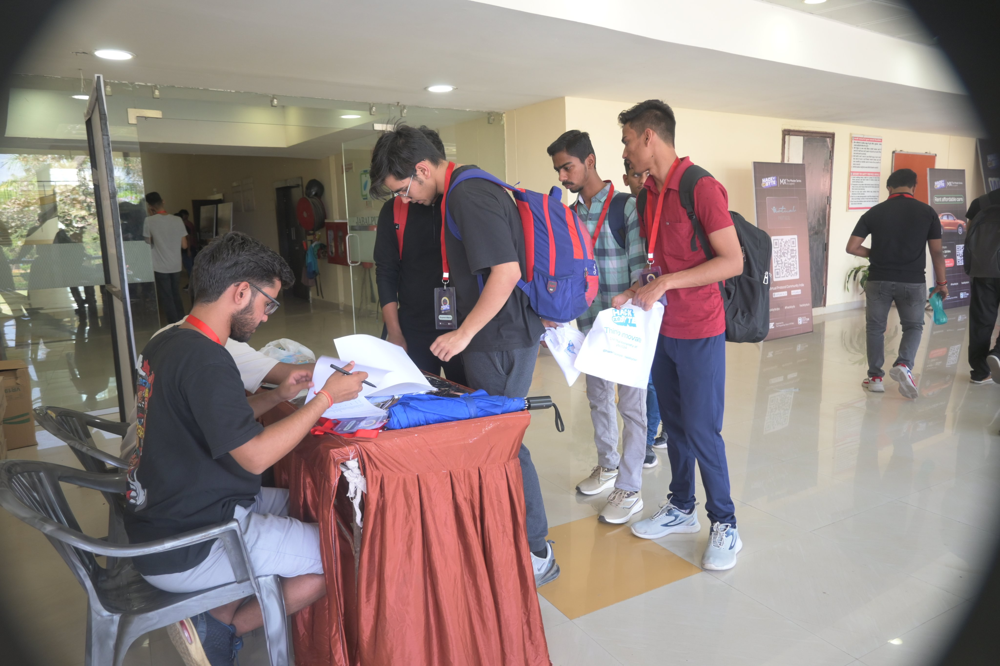 |
|:--:|
| <b> Hackers checkin @5th April Afternoon </b>|

| 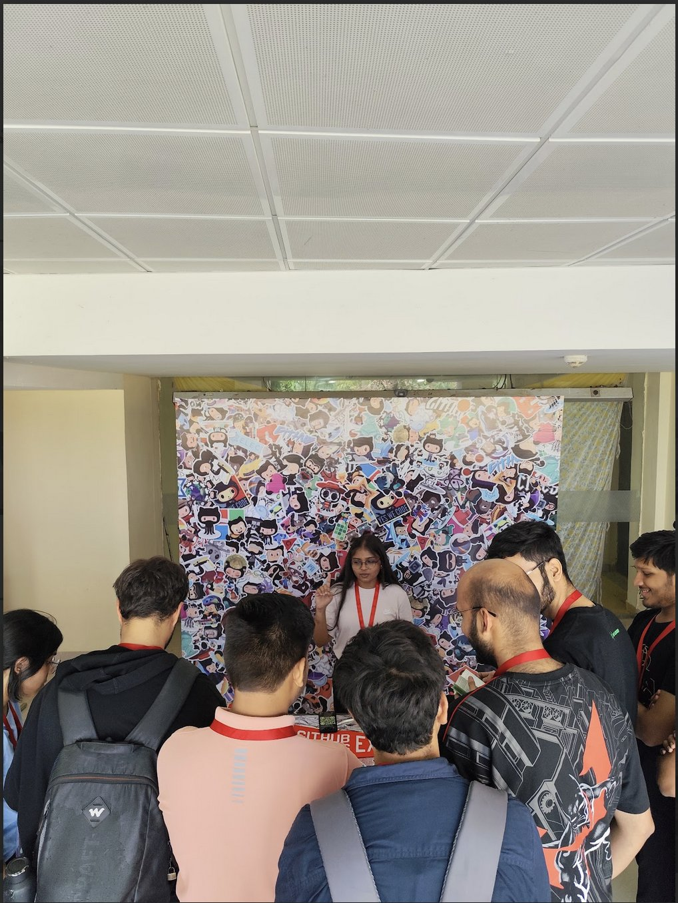 |
|:--:|
| <b> Scenes from the GitHub booth</b>|

| 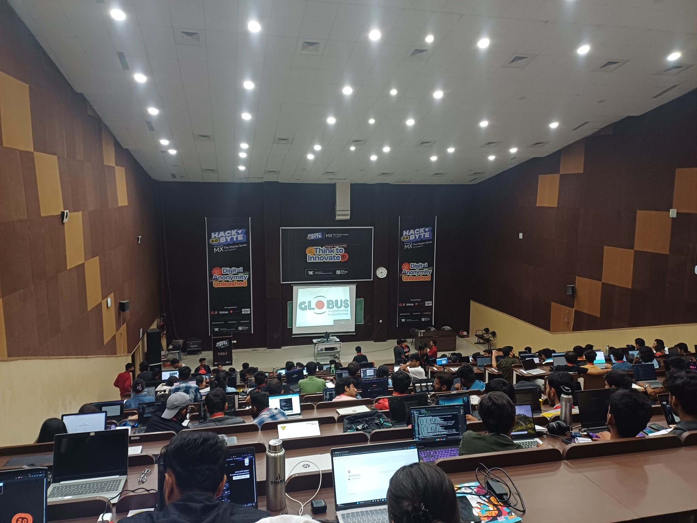 |
|:--:|
| <b> Hacking Hall L104, seated 200ish hackers </b>|

| 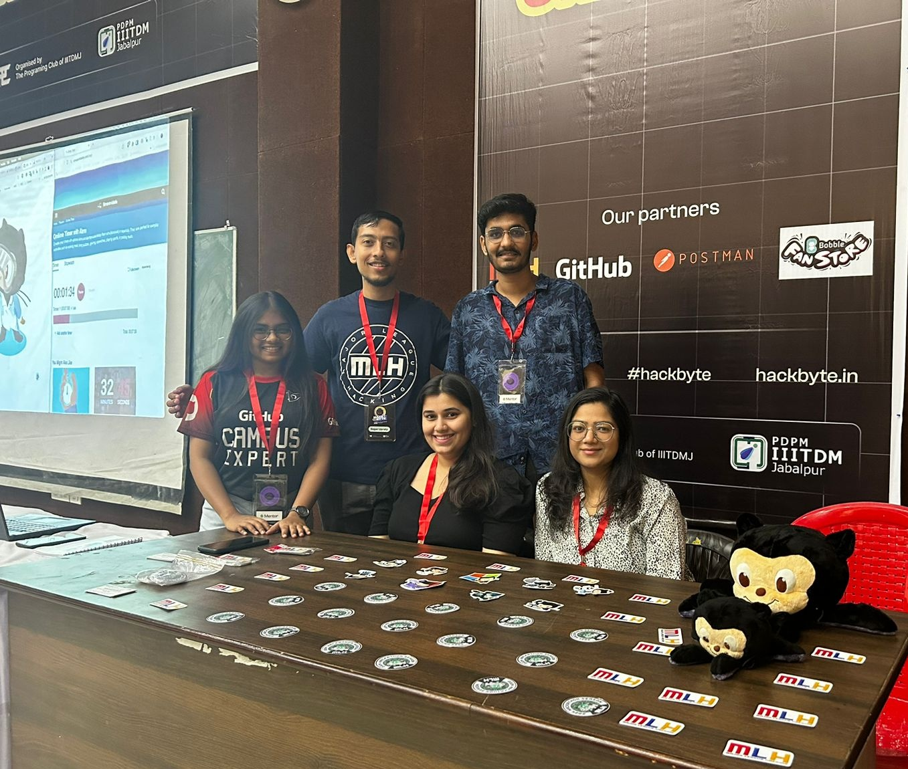 |
|:--:|
| <b> Some of the mentors posing with Mona </b>|

| 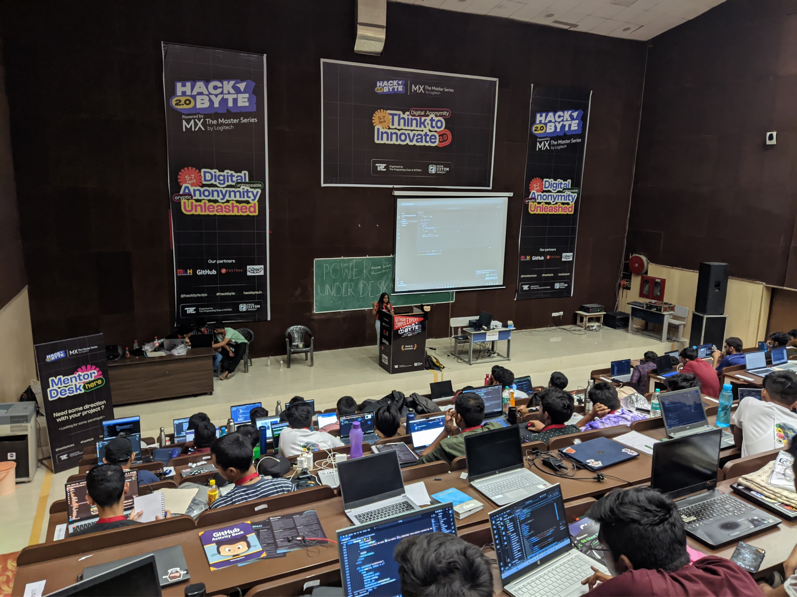 |
|:--:|
| <b> Sanskriti, GCE conducting a workshop on GitHub Codespaces </b>|

| 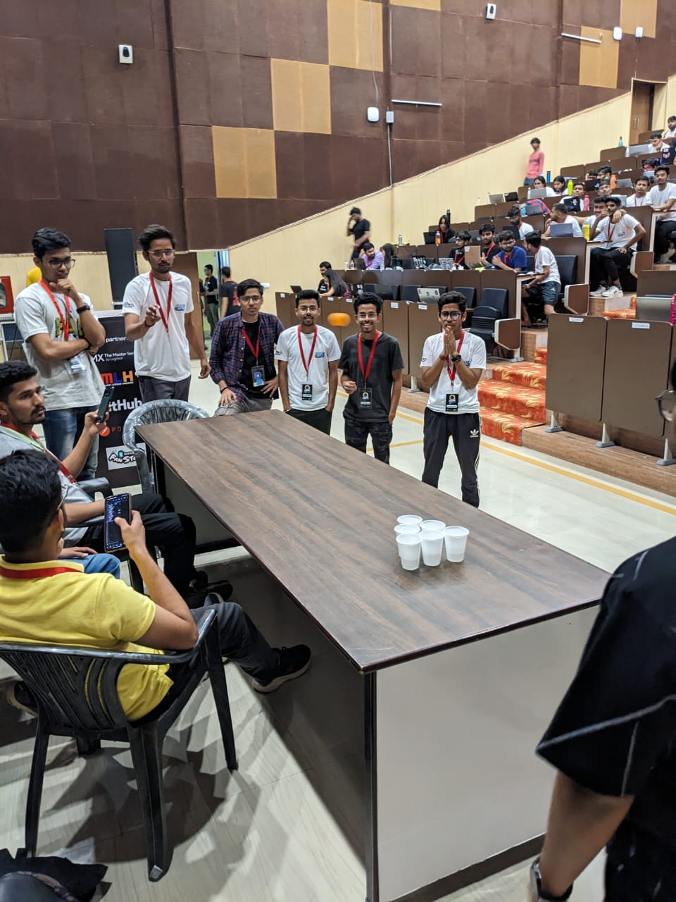 |
|:--:|
| <b> Hackers trying out a fun event at 4AM </b>|

| 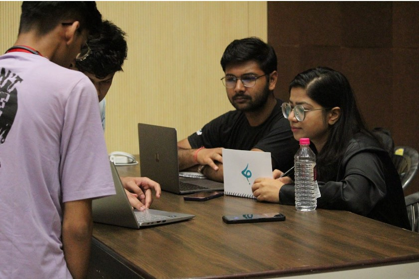 |
|:--:|
| <b> Final Judging on Sunday morning </b>|

| 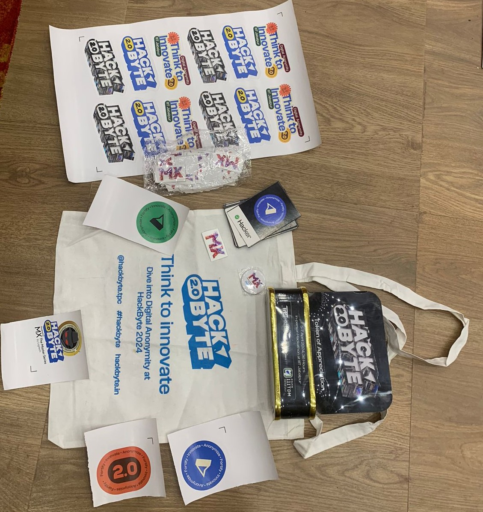 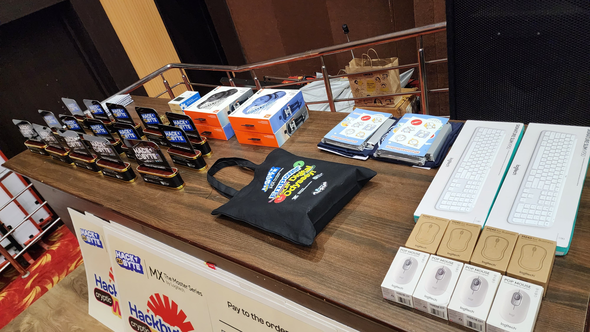 |
|:--:|
| <b> Swag kits for the winners </b>|

## What’s Next?
HackByte 2.0 served as a platform for innovation and networking, bringing together tech enthusiasts to build and innovate in public. Hackers travelled from Kolkata, Ranchi, Surat, Chennai, Vijayawada, Delhi and Mumbai, curating a diverse bunch at HackByte.
To not limit the creativity of our amazing hackers, we decided to not pursue specific "tracks", instead having a central theme of "Digital Anonymity". Projects that aligned with our theme got bonus points : )

Getting positive reviews from hackers filled our hearts and we have HackByte 3.0 on the drawing board as well. Expected dates are 4-6 April 2025 {the first weekend of April}, but this might change as per the academic calendars and accounting for festivals.

Twitter handle -[@HackByteTPC](https://twitter.com/HackbyteTPC) 
Instagram handle - [@hackbyte.tpc](https://www.instagram.com/hackbyte.tpc/)
